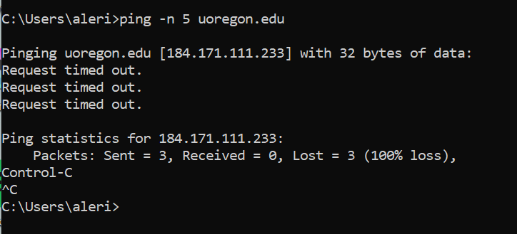
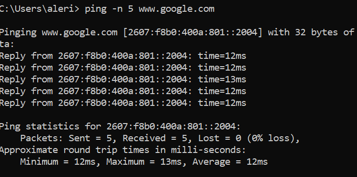
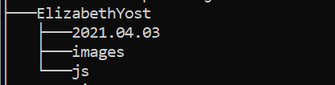
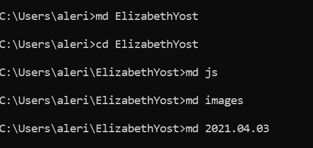
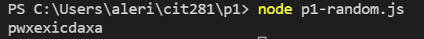

## Techniques Used 

- CLI commands 
- Non-web server Node.js JavaScript code
- Functions
- for loops
- Arrays
- Date objects
- .fromCharCode() method
- console.log() method

## Objective

Practice completing tasks using the command line interface. 

Create a block of code which returns a string of 5-25 random letters from the English alphabet using non-server node.js javascript code.

`function getRandomInteger(min, max) {
    return Math.floor(Math.random() * (max - min) + min);
}
let randomWord = ""

for(i=0; i <= getRandomInteger(5, 26); i++){
    //convert a number on ascii table to a letter and apend it to randomWord
    randomWord = randomWord + String.fromCharCode(getRandomInteger(97, 123))
}
console.log(randomWord)`

Result example:

Create a block of code which returns a random day of the week. 

`let daysOfWeek = ["Monday", "Tuesday", "Wednesday", "Thursday", "Friday", "Saturday", "Sunday"]
let today = new Date()
console.log(daysOfWeek[(today.getDay())- 1])`

Result example:

